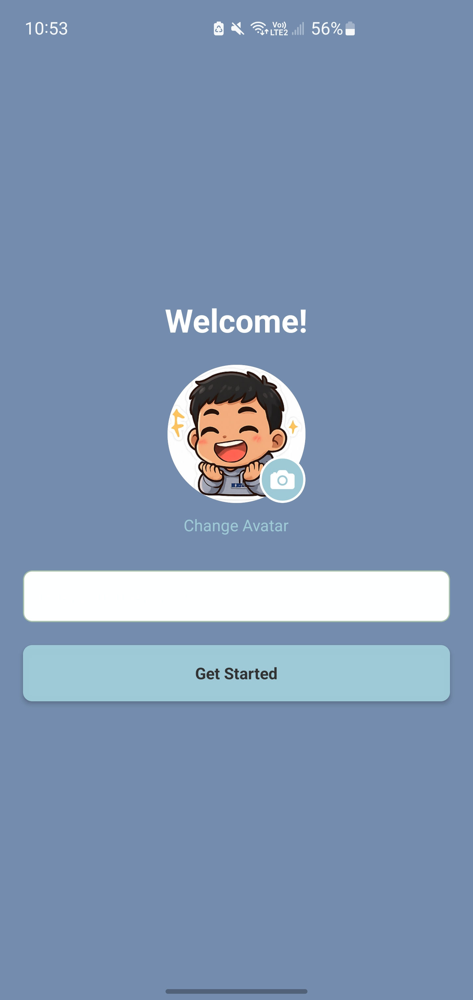
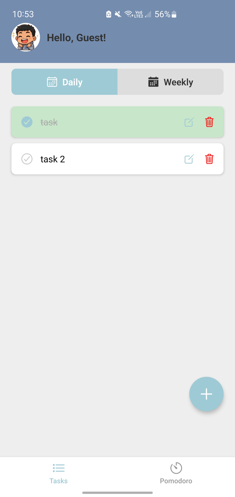
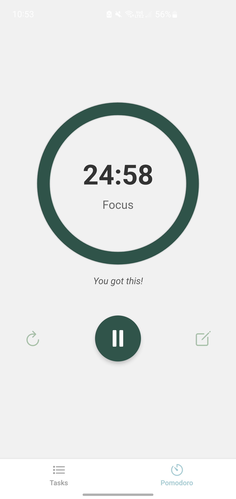

# Task Pomodoro

Task Pomodoro is a **minimalist productivity app** built with **React Native** and **Expo**, designed to help users **manage tasks** (daily & weekly) while staying focused using the **Pomodoro technique**.

---

## Features
- **User Profile**: Set and save your **username** and **avatar** (persisted across sessions).
- **Task Management**: Create, edit, and delete **daily** and **weekly tasks**.
- **Task Completion**: Mark tasks as **completed** with a simple tap.
- **Persistent Storage**: All data (username, avatar, tasks) is stored locally using **AsyncStorage**, so it stays even after restarting the app.
- **Pomodoro Timer**: Focus timer to boost productivity.
- **Minimalist UI**: Clean, distraction-free interface.

---

## Screenshots
Here are some screens of the app:






---

## Tech Stack
- [React Native](https://reactnative.dev/)
- [Expo](https://expo.dev/)
- [EAS Build](https://docs.expo.dev/build/introduction/)
- [AsyncStorage](https://react-native-async-storage.github.io/async-storage/)

---

## Installation & Setup

### Prerequisites
- [Node.js](https://nodejs.org/) (LTS)
- [Expo CLI](https://docs.expo.dev/more/expo-cli/)
- [EAS CLI](https://docs.expo.dev/eas/)


### 1. Clone the Repository
```bash
git clone https://github.com/joshmrcr/Task_Pomodoro.git
cd Task_Pomodoro
```
### 2. Install dependencies
```bash
npm install
```
### 3. Start Development Server
```bash
npx expo start
```

---
## Building the App
## Development Build (Install on your device)
```bash
eas build -p android --profile preview
```
----

## File Structure
```bash
Task_Pomodoro/
├── app/
│   ├── index.tsx         # Welcome screen (username & avatar setup)
│   ├── tabs/
│   │   └── home.tsx      # Home screen with tasks
│
├── assets/               # App images & icons
├── constants/
│   └── colors.ts         # Centralized color palette
├── eas.json              # EAS build profiles
├── App.json              # App configuration
├── package.json
```


### Author
##Brian Joshua Marcera
##Minimalist UI/UX Designer & Software Engineer
##GitHub


